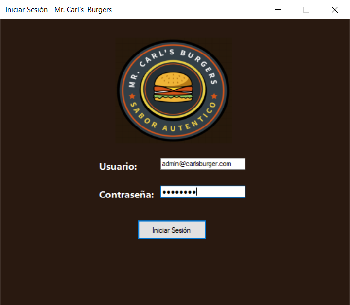
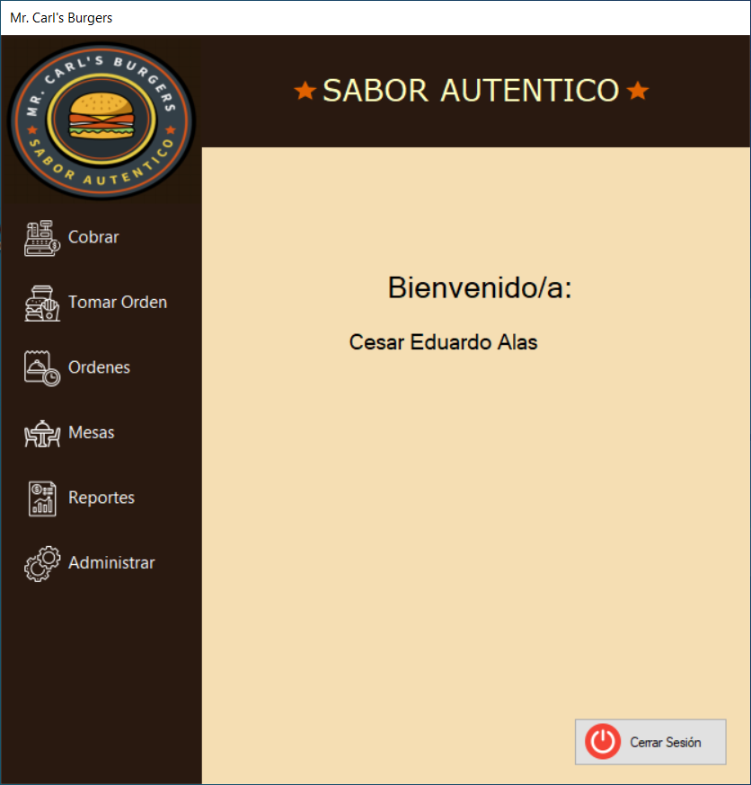
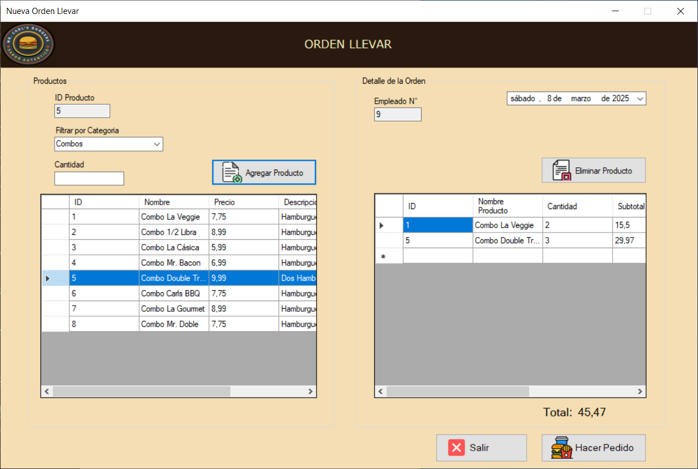
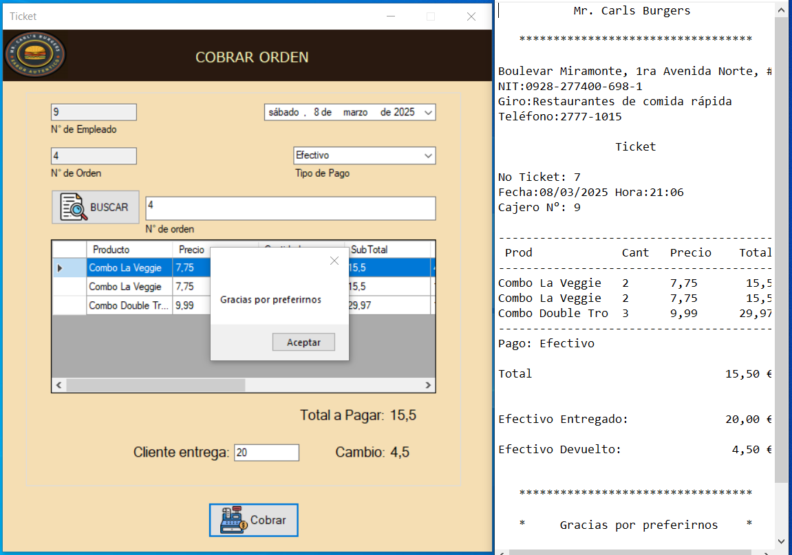

# 🍔 Carl's Burgers - Sistema POS para Restaurantes

Carl's Burgers es un sistema POS diseñado para la gestión eficiente de restaurantes de comida rápida. Permite administrar pedidos, mesas, empleados y ventas con una interfaz intuitiva y funcional.

##  Características Principales

✅ **Gestión de Usuarios:**

- Control de empleados con roles: Gerente, Mesero, Cajero y Cocinero.
- Seguridad en el acceso mediante credenciales.

✅ **Gestión de Pedidos:**

- Creación de pedidos y asignación a mesas.
- Panel de seguimiento de pedidos: *Pendientes* y *Entregados*.
- Opciones de pago: Efectivo y Transferencia bancaria.
- Impresión de tickets de venta.

✅ **Gestión de Mesas:**

- Asignación de pedidos a mesas específicas.
- Control del estado de cada mesa.

✅ **Reportes de Ventas:**

- Reportes detallados de ventas.
- Filtros por rango de fechas.

✅ **Gestión del Menú:**

- Organización por categorías.
- Registro y actualización de productos.

---

## 📸 Capturas de Pantalla

### 👤 Login  


### 🏠 Pantalla principal  


### 📋 Gestión de pedidos  


### 💳 Procesamiento de pagos  


---

## 🛠️ Tecnologías Utilizadas

- **C#** con **Windows Forms**
- **Entity Framework** para la gestión de base de datos
- **SQL Server** como motor de base de datos

---

## 🏗️ Instalación y Configuración

1️⃣ Clona el repositorio:

```sh
 git clone https://github.com/ceduar888/carlburgers.git
```

2️⃣ Configura la base de datos en **SQL Server**:

- Crea una base de datos llamada `Restaurante_DB`.
- Copia el script de base de datos (`scriptSQL.`text) ubicado en la carpeta raíz del proyecto y ejecutalo en tu SQL Server

3️⃣ Configura la conexión en `App.config`:

```xml
<connectionStrings>
    <add name="DataBase_RestaurantEntities" connectionString="metadata=res://*/Modelo.csdl|res://*/Modelo.ssdl|res://*/Modelo.msl;provider=System.Data.SqlClient;provider connection string=&quot;data source=TU_SERVIDOR;initial catalog=Restaurante_DB;integrated security=True;MultipleActiveResultSets=True;App=EntityFramework&quot;" providerName="System.Data.EntityClient" />
</connectionStrings>
```

4️⃣ Compila y ejecuta el proyecto en **Visual Studio**.

---

## 📄 Licencia

Este proyecto está bajo la licencia **MIT**. Puedes usarlo y modificarlo libremente.

---

## ✉️ Contacto

📧 **Email:** [csaralas16@gmail.com](mailto\:csaralas16@gmail.com)\
🔗 **GitHub:** https\://github.com/ceduar888

